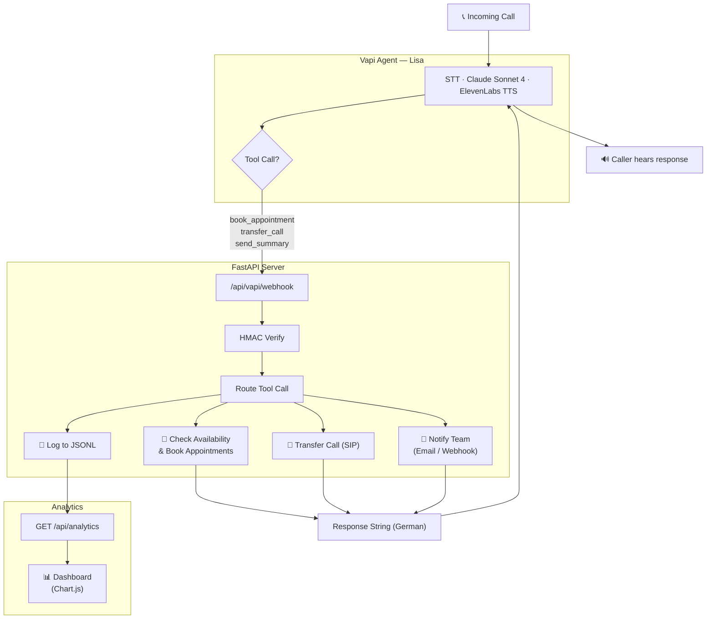

# Voice Agent — Praxis Dr. Müller

[](#tech-stack)
[](https://vapi.ai)
[](#live-vapi-call-results)
[](#tests)
[](#deployment)
[](#license)

   

**AI phone agent for medical practices — answers calls in German, books appointments with availability checking, detects emergencies, transfers calls, and adapts greetings to holidays and office hours.** Multi-practice support via YAML config. 156 tests, analytics dashboard, 5/5 live scenarios passed.

## Table of Contents

- [Quick Start](#quick-start)
- [What It Does](#what-it-does)
- [Architecture](#architecture)
- [Project Structure](#project-structure)
- [Live Vapi Call Results](#live-vapi-call-results)
- [Configuration](#configuration)
- [Multi-Practice Support](#multi-practice-support)
- [Holiday & Hours-Aware Greetings](#holiday--hours-aware-greetings)
- [Analytics Dashboard](#analytics-dashboard)
- [Setup](#setup)
- [Deployment](#deployment)
- [Tests](#tests)
- [Tech Stack](#tech-stack)
- [Costs (Verified)](#costs-verified)

## Prerequisites

- Python 3.12+
- [Vapi.ai](https://vapi.ai) account (Free Tier, $10 credits)
- [ngrok](https://ngrok.com) or similar tunnel for local development
- Anthropic API access (via Vapi — no separate key needed)
- Docker (optional, for deployment)

## Quick Start

```bash
# 1. Setup
python3 -m venv venv
source venv/bin/activate
pip install -r requirements.txt

# 2. Configure
cp .env.example .env  # then fill in your keys

# 3. Create Vapi Assistant
python scripts/setup_vapi.py --webhook-url https://your-tunnel.ngrok.io

# 4. Start webhook server
python src/main.py
```

## What It Does

Lisa, the AI assistant for Dr. Sarah Müller's practice, answers incoming calls in German:

- Greets callers context-aware (holiday / outside hours / normal) and asks for their concern
- Distinguishes new and existing patients
- Books appointments with availability checking (`book_appointment`) — suggests alternatives when slots are taken
- Transfers calls to the practice for prescriptions/referrals (`transfer_call`) — real phone transfer via Vapi
- Detects emergencies and immediately recommends calling 112
- Sends call summaries to the practice team via email and/or webhook (`send_summary`)
- Answers questions about office hours and address

## Architecture



## Project Structure

```
voice-agent/
├── src/
│   ├── main.py              # Entry point — starts webhook server
│   ├── agent_config.py      # System prompt, tools, voice/model config (YAML-driven)
│   ├── webhook_server.py    # FastAPI server for Vapi tool calls + analytics API
│   ├── analytics.py         # Call log analytics (KPIs, charts data)
│   ├── holidays.py          # German holiday detection + office hours check
│   ├── webhook_auth.py      # HMAC-SHA256 signature verification middleware
│   ├── availability.py      # Appointment slot checking & booking
│   ├── notifications.py     # Email (SMTP) + webhook notification dispatch
│   └── call_logger.py       # JSONL call logging
├── scripts/
│   ├── setup_vapi.py        # Automated Vapi assistant + tools + phone setup
│   └── test_call.py         # Trigger test calls for 5 scenarios
├── configs/
│   ├── scenarios.yaml       # 5 test scenarios (appointment, prescription, emergency, etc.)
│   ├── availability.yaml    # Office hours, holidays, slot duration, bookings path
│   ├── praxis_template.yaml # Base template for new practice configs
│   └── examples/            # Example practice configs (Mueller, Schmidt, Weber)
├── static/
│   └── dashboard.html       # Call analytics dashboard (Chart.js)
├── tests/                   # 156 tests
│   ├── test_agent_config.py # Agent configuration (42 tests)
│   ├── test_analytics.py    # Call analytics (19 tests)
│   ├── test_holidays.py     # Holiday detection + greetings (29 tests)
│   ├── test_webhook.py      # Webhook endpoints (22 tests)
│   ├── test_availability.py # Availability system (23 tests)
│   ├── test_notifications.py# Notification dispatch (12 tests)
│   └── test_webhook_auth.py # HMAC auth + transfer (9 tests)
├── data/
│   ├── call_log.jsonl       # Call event log (auto-created)
│   └── bookings.json        # Booked appointments (auto-created)
├── Dockerfile               # Production container
├── fly.toml                 # Fly.io deployment config
└── docker-compose.yml       # Local Docker deployment
```

## Live Vapi Call Results

Verified with live Vapi calls on 2026-04-14. Assistant "Lisa" (ID: `2f93f394`) on Vapi Free Tier.

| # | Scenario | Caller | Expected Action | Result | Notes |
|---|----------|--------|----------------|--------|-------|
| 1 | New patient, back pain | Thomas Schneider | `book_appointment` | PASS | Appointment booked, new patient recognized |
| 2 | Existing patient, prescription | Maria Weber | `transfer_call` | PASS | Transferred to practice for prescription refill |
| 3 | Emergency, chest pain | Hans Müller | Recommend 112 | PASS | Immediate emergency detection, 112 recommended |
| 4 | Office hours inquiry | Anna Schmidt | Provide info | PASS | Office hours read correctly from config |
| 5 | Pharma representative | Dr. Klaus Fischer | `send_summary` | PASS | Summary created, action_required flag set |

**5/5 scenarios passed** — all webhook handlers triggered correctly, fluent German responses.

```bash
# List scenarios
python scripts/test_call.py --list

# Run specific scenario
python scripts/test_call.py --scenario 1 --assistant-id <ID>
```

## Configuration

Set in `.env`:

```bash
# Required
VAPI_API_KEY=your-vapi-api-key

# Webhook auth (optional — disabled if not set)
VAPI_WEBHOOK_SECRET=your-hmac-secret

# Transfer destination
PRAXIS_PHONE_NUMBER=+498912345678

# Email notifications (optional — skipped if not set)
SMTP_HOST=smtp.gmail.com
SMTP_PORT=587
SMTP_USER=praxis@example.com
SMTP_PASSWORD=app-password
NOTIFICATION_EMAIL_TO=team@example.com
NOTIFICATION_EMAIL_FROM=lisa@example.com

# Webhook notifications (optional — skipped if not set)
NOTIFICATION_WEBHOOK_URL=https://hooks.slack.com/services/...

# Server
HOST=0.0.0.0
PORT=8000
DEBUG=true
```

## Multi-Practice Support

The agent is configurable for any medical practice via YAML:

```bash
# Setup with custom practice config
python scripts/setup_vapi.py --webhook-url https://... --config configs/examples/praxis_schmidt_zahnarzt.yaml

# Default: Praxis Dr. Müller
python scripts/setup_vapi.py --webhook-url https://your-tunnel.ngrok.io
```

New practice = new YAML file. See `configs/praxis_template.yaml` for all fields.

## Holiday & Hours-Aware Greetings

Lisa's greeting adapts automatically:

| Situation | Greeting (in German) |
|-----------|---------------------|
| Holiday | "The practice is closed today due to {holiday}. In emergencies..." |
| Outside hours | "The practice is currently closed. Our office hours are..." |
| Normal hours | Standard greeting from practice YAML config |

Holidays are configured in `configs/availability.yaml` (13 German holidays: 9 federal + 4 Bavaria).

## Analytics Dashboard

View call analytics at `http://localhost:8000/static/dashboard.html`:

- KPI cards: total calls, calls today, booking rate, average duration
- Bar chart: top appointment reasons
- Timeline: calls per day
- Date range filter

API: `GET /api/analytics?from=2026-04-01&to=2026-04-14`

## Setup

```bash
# Basic — creates assistant with tools
python scripts/setup_vapi.py --webhook-url https://your-tunnel.ngrok.io

# With webhook auth
python scripts/setup_vapi.py --webhook-url https://... --webhook-secret my-secret

# With phone number provisioning
python scripts/setup_vapi.py --webhook-url https://... --phone-number
```

## Deployment

```bash
# Docker
docker compose up --build

# Fly.io (Frankfurt region)
fly deploy
```

## Tests

```bash
pytest tests/ -v
# 156 tests covering agent config, analytics, holidays, webhook server, availability, notifications, auth
```

## Tech Stack

| Component | Version / Detail |
|-----------|-----------------|
| Python | 3.12+ |
| FastAPI | webhook server |
| uvicorn | ASGI server |
| Vapi.ai | voice + LLM orchestration |
| vapi-server-sdk | assistant/tool CRUD |
| Claude Sonnet 4 | LLM (via Vapi) |
| ElevenLabs | TTS (German voice) |
| Chart.js | analytics dashboard |
| Docker | production container |
| Fly.io | deployment (Frankfurt) |

## Costs (Verified)

| Component | Cost | Verified |
|-----------|------|----------|
| Vapi Free Tier | $10 credits (~200 min) | 2026-04-14 |
| Phone Number | ~$1/month | 2026-04-14 |
| Claude Sonnet 4 (via Vapi) | ~$0.01-0.03/call | 2026-04-14 |
| **5 Live Test Calls** | **~$0.50 total** | 2026-04-14 |

## License

MIT
